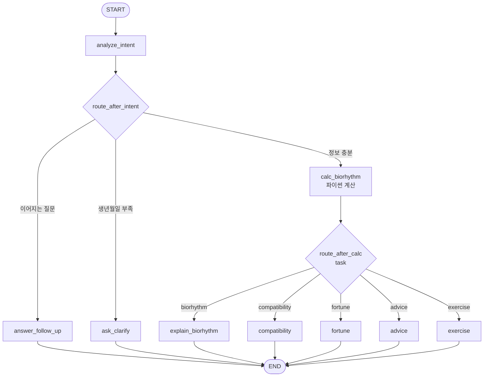

# 3조 - 바이오리듬

> 한 줄 소개: 생년월일로 바이오리듬을 계산해서 궁합, 오늘의 운세, 오늘의 조언, 운동까지 추천해 주는 컨디션 코치

**예시 질문**

1. 1995년 3월 15일생인데 오늘 내 바이오리듬 어때?
2. 나는 1993-07-02, 여자친구는 1995-11-20인데 바이오리듬 궁합 봐줘
3. 92년 5월 8일생이야. 퇴근하고 무슨 운동 하면 좋을까?

**주제 선정 회의**

> 조원이 실제로 모여서 주제를 정했는지 확인하는 항목입니다. 빈칸 없이 채워주세요.

| 항목 | 내용 |
|---|---|
| 회의 일시 | 2026-09-17 (목) 14:00 ~ 15:00 |
| 회의 장소 | TC동 6층 IT지원실1 회의실1 |
| 참석자 | 남경효M, 박성현M, 김기웅M, 변태형M, 송치욱M, 신호경M - 6명 중 6명 |
| 불참자 / 사유 | 없음 |
| 기록자 | 박성현M |

---

## 1. LangGraph 워크플로우 설계

### 1.1 State 스키마

| 필드 | 타입 | 설명 |
|---|---|---|
| user_input | str | 이번 턴 사용자 입력 (공용 제공) |
| messages | list[dict] | 이전 대화 이력 (공용 제공) |
| answer | str | 최종 답변 (공용 제공) |
| intent | str | `"new"`(새 요청) / `"followup"`(방금 답변에 이어지는 질문) |
| task | str | 사용자가 원하는 것: `biorhythm` / `compatibility` / `fortune` / `advice` / `exercise` |
| birth_date | str \| None | 본인 생년월일 `YYYY-MM-DD` |
| partner_birth_date | str \| None | 궁합 상대 생년월일 `YYYY-MM-DD` (궁합일 때만 필수) |
| target_date | str | 보고 싶은 날짜 `YYYY-MM-DD` (기본값: 오늘) |
| missing | list[str] | 아직 모르는 필수 항목 (`birth_date`, `partner_birth_date`) |
| bio_report | str | calc_biorhythm 이 파이썬으로 계산한 결과 텍스트 (해설 노드의 입력) |

### 1.2 노드 구성

| 노드 | 역할 | 읽는 필드 | 쓰는 필드 |
|---|---|---|---|
| analyze_intent | (LLM) 원하는 것(task)·이어지는 질문 여부·날짜 정보 추출, 코드로 날짜 검증 | user_input, messages | intent, task, birth_date, partner_birth_date, target_date, missing |
| ask_clarify | (LLM) 빠진 생년월일을 예시와 함께 되묻기 | task, birth_date, partner_birth_date, missing, messages | answer |
| answer_follow_up | (LLM) 방금 답변에 이어지는 질문에 답하기 (생년월일을 알면 계산 결과도 참고) | user_input, messages, birth_date, target_date, task | answer |
| calc_biorhythm | (**LLM 없음, 파이썬**) 신체23/감성28/지성33일 주기 수치, 위험일, 7일 흐름, 궁합 점수 계산 | birth_date, partner_birth_date, target_date, task | bio_report |
| explain_biorhythm | (LLM) 바이오리듬 수치 해설 + 7일 중 좋은 날/주의할 날 | bio_report, user_input, messages | answer |
| compatibility | (LLM) 바이오리듬 궁합 해설 | bio_report, user_input, messages | answer |
| fortune | (LLM) 오늘(지정일)의 운세 | bio_report, user_input, messages | answer |
| advice | (LLM) 오늘의 행동 조언 (업무/대인관계/셀프케어) | bio_report, user_input, messages | answer |
| exercise | (LLM) 신체 리듬 기반 운동 강도·종목 추천 | bio_report, user_input, messages | answer |

### 1.3 엣지 & 조건 분기

| 출발 | 조건 | 도착 |
|---|---|---|
| START | - | analyze_intent |
| analyze_intent | intent == "followup" 이고 이전 대화가 있음 | answer_follow_up |
| analyze_intent | missing 이 비어있지 않음 (생년월일 부족) | ask_clarify |
| analyze_intent | 그 외 (정보 충분) | calc_biorhythm |
| calc_biorhythm | task == "biorhythm" | explain_biorhythm |
| calc_biorhythm | task == "compatibility" | compatibility |
| calc_biorhythm | task == "fortune" | fortune |
| calc_biorhythm | task == "advice" | advice |
| calc_biorhythm | task == "exercise" | exercise |
| answer_follow_up, ask_clarify, 해설 노드 5개 | - | END |

### 1.4 워크플로우 다이어그램



### 1.5 이 구조로 설계한 이유

- **계산과 해석을 분리했습니다.** 바이오리듬은 `sin(2π × 살아온 날 / 주기)` 라는 정해진 공식이라 답이 하나입니다. LLM 에게 계산까지 시키면 같은 생년월일인데도 물을 때마다 수치가 달라졌습니다. 그래서 계산은 LLM 없는 `calc_biorhythm` 노드(파이썬)가 맡고, LLM 노드들은 그 결과를 해석만 하도록 나눴습니다. 덕분에 수치는 항상 정확하고, 프롬프트는 "어떻게 설명할지"에만 집중할 수 있습니다.
- **기능별로 전문 노드를 나눴습니다.** 궁합·운세·조언·운동은 같은 수치를 보더라도 말투, 형식, 지켜야 할 규칙이 서로 다릅니다. (예: 궁합은 부정적 단정 금지, 운동은 강도 기준표, 운세는 별점) 프롬프트 하나에 다 넣으면 규칙이 섞여서 운동을 물었는데 운세 문구가 섞이는 식의 문제가 생기므로, 노드마다 프롬프트를 따로 두고 `task` 로 분기했습니다.
- **분기를 두 단계로 뒀습니다.** 1단계(analyze_intent 뒤)는 "계산이 가능한가"를 봅니다. 생년월일이 없으면 계산 자체가 불가능하므로 해설 노드까지 가기 전에 되묻습니다. 2단계(calc_biorhythm 뒤)는 "무엇을 해설할까"를 봅니다. 계산은 모든 기능이 공통으로 쓰므로 한 번만 하고 갈라지게 했습니다.
- **멀티턴을 고려했습니다.** 첫 턴에 생년월일을 말하면 다음 턴부터는 "내일은?", "운동도 추천해줘" 만 말해도 이전 대화에서 생년월일을 다시 찾아 씁니다. "위험일이 뭐야?" 같은 이어지는 질문은 계산·해설을 다시 돌리지 않고 answer_follow_up 이 바로 답합니다.
- **LLM 출력을 코드로 한 번 더 검증합니다.** analyze_intent 가 뽑은 날짜를 파이썬으로 파싱해서, 없는 날짜(2월 30일)나 미래 생일이면 계산하지 않고 되묻습니다.

---

## 2. 프롬프트 엔지니어링

> ⚠️ 아래 '개선 전 -> 후' 표는 설계 과정에서 예상되는 문제를 기준으로 쓴 **초안**입니다.
> 실제로 돌려보면서 나온 이상한 출력으로 '그때의 문제' 칸을 바꿔 적어주세요.

### 2.0 공통 규칙 (COMMON_RULES)

해설 노드 5개(explain_biorhythm, compatibility, fortune, advice, exercise)의 프롬프트 뒤에 공통으로 붙는 규칙입니다.
노드마다 같은 문장을 복사하지 않고 한 곳에서 관리하려고 분리했습니다.

```
[공통 규칙]
- 수치는 반드시 [계산 결과]에 적힌 값만 인용하세요. 직접 계산하거나 숫자를 바꾸지 마세요.
- [위험일] 표시가 있는 리듬은 "리듬이 바뀌는 전환점이라 컨디션이 흔들리기 쉬운 날" 정도로만 설명하고 겁주지 마세요.
- 바이오리듬은 과학적으로 검증된 이론이 아니라 재미로 보는 참고 지표입니다. 단정적으로 예언하지 마세요.
- 친근한 존댓말로, 마크다운을 사용해 읽기 쉽게 작성하세요.
```

### 2.1 analyze_intent

**최종 System Prompt** (`ANALYZE_INTENT_SYSTEM`)

```
당신은 바이오리듬 상담 창구의 접수 담당자입니다.
이전 대화와 이번 발화를 합쳐서 아래 항목을 채우세요.
이번 발화 맨 앞의 [오늘 날짜] 는 시스템이 붙인 정보입니다. 날짜 계산에만 쓰세요.

- intent: 이번 발화의 성격
  - "new": 바이오리듬·궁합·운세·조언·운동을 새로 봐달라는 요청.
           날짜나 사람이 바뀐 요청("그럼 내일은?", "엄마랑도 봐줘")도 "new" 입니다.
  - "followup": 방금 한 답변에 대한 추가 질문 ("위험일이 뭐야?", "왜 그래?", "그 운동 몇 분 해?")
  - 이전 대화가 없으면 항상 "new" 입니다.
- task: 아래 중 하나
  - "biorhythm": 내 바이오리듬 수치나 상태가 궁금함 (애매하면 이것)
  - "compatibility": 다른 사람과의 궁합
  - "fortune": 오늘(또는 특정 날짜) 운세
  - "advice": 오늘의 조언, 무엇에 집중하고 무엇을 조심할지
  - "exercise": 운동 추천
  - followup 이면 직전 요청의 task 를 그대로 씁니다.
- birth_date: 사용자 본인의 생년월일 "YYYY-MM-DD" (모르면 null)
- partner_birth_date: 궁합 상대의 생년월일 "YYYY-MM-DD" (모르면 null)
- target_date: 보고 싶은 날짜 "YYYY-MM-DD"
  - 언급이 없거나 "오늘"이면 [오늘 날짜]
  - "내일", "이번 주 금요일" 등은 [오늘 날짜] 기준으로 계산

규칙:
- 앞선 대화에서 나온 생년월일은 이번 발화에 없어도 그대로 유지합니다. 새 값이 나오면 덮어씁니다.
- 두 자리 연도는 미래가 되지 않는 쪽으로 해석합니다. ("95년" → 1995, "03년" → 2003)
- 연·월·일 중 하나라도 빠졌으면 지어내지 말고 null 로 둡니다.

반드시 아래 JSON 형식으로만 답하세요. 설명 문장을 붙이지 마세요.

{"intent": "new", "task": "biorhythm", "birth_date": null, "partner_birth_date": null, "target_date": "YYYY-MM-DD"}
```

**설계 의도**

- 사용자가 원하는 것(task 5종)과 이어지는 질문 여부(intent)를 한 번에 판정합니다.
- 생년월일·궁합 상대 생년월일·기준 날짜를 `YYYY-MM-DD` 로 정규화해서 뽑습니다. "95년 3월 15일", "내일" 같은 표현도 코드가 바로 쓸 수 있는 형태로 바꾸는 것이 목적입니다.
- 오늘 날짜를 발화 앞에 붙여 넘겨서 "내일", "이번 주 금요일" 을 계산할 수 있게 했습니다.
- 지어낸 생년월일로 엉뚱한 결과가 나오지 않도록 빠진 값은 null 로 두게 하고, 코드에서 날짜 형식·미래 날짜를 한 번 더 검증합니다.

**개선 전 -> 후**

| 구분 | 내용 |
|---|---|
| 개선 전 | 바이오리듬 관련 질문인지 판단하고, 생년월일을 뽑아 JSON 으로 답하세요. |
| 그때의 문제 | "95년 3월생인데 오늘 어때?" 처럼 일(日)이 빠졌는데 `"birth_date": "1995-03-01"` 로 날짜를 지어냄. "내일 운세" 를 물어도 기준일을 알 수 없어 오늘로 계산됨. |
| 개선 후 | 연·월·일 중 하나라도 빠지면 null 규칙 추가, 두 자리 연도 해석 규칙 추가, 발화 앞에 [오늘 날짜] 를 붙여 target_date 를 계산하게 함. |
| 달라진 점 | 생년월일이 불완전하면 ask_clarify 로 가서 되묻고, "내일"·"금요일" 요청이 정확한 날짜로 계산됨. |


### 2.2 ask_clarify

**최종 System Prompt** (`ASK_CLARIFY_SYSTEM`)

```
당신은 친절한 바이오리듬 상담사입니다.
계산에 필요한데 아직 모르는 정보를 사용자에게 되묻는 짧은 메시지를 작성하세요.

- 바이오리듬은 태어난 날(양력)부터 계산한다는 이유를 한 줄로 알려주세요.
- 한 번에 최대 2가지만 묻습니다.
- 3문장 이내로 답합니다.
- 입력 예시를 하나 곁들이세요. (예: 1995-03-15 또는 "95년 3월 15일")
```

**설계 의도**

- 계산에 꼭 필요한 정보(본인/상대 생년월일)만 짧게 되묻습니다.
- 왜 생년월일이 필요한지 한 줄 설명하고, 입력 예시를 보여줘서 다음 턴에 analyze_intent 가 정확히 뽑을 수 있게 유도합니다.

**개선 전 -> 후**

| 구분 | 내용 |
|---|---|
| 개선 전 | 생년월일을 물어보세요. |
| 그때의 문제 | "정확한 바이오리듬을 위해 태어난 시간과 장소도 알려주세요" 처럼 사주처럼 불필요한 정보까지 요구함. |
| 개선 후 | 바이오리듬은 양력 생년월일만으로 계산한다는 이유를 말하게 하고, 최대 2가지만 묻도록 제한, 입력 예시 추가. |
| 달라진 점 | 필요한 것만 묻고, 사용자가 예시 형식대로 답해 다음 턴 인식률이 올라감. |


### 2.3 explain_biorhythm

**최종 System Prompt** (`EXPLAIN_SYSTEM`)

```
당신은 바이오리듬 해설가입니다.
[계산 결과]를 바탕으로 사용자의 바이오리듬을 알기 쉽게 설명하세요.

형식:
1. 첫 줄: 오늘 컨디션 한 줄 요약
2. 신체 / 감성 / 지성 각각 수치와 의미 1~2문장
   - 신체: 체력·활동성·면역 / 감성: 기분·감정·대인관계 / 지성: 집중력·판단력·기억력
3. 향후 7일 중 가장 좋은 날과 가장 주의할 날을 1줄씩
4. 마지막 줄: 바이오리듬 원리 한 줄 (태어난 날부터 23·28·33일 주기로 오르내리는 곡선)

15줄 이내로 씁니다.
```

> 이 노드의 프롬프트 뒤에는 2.0 의 `COMMON_RULES` 가 붙습니다.

**설계 의도**

- 신체/감성/지성 수치를 각각 무엇을 뜻하는지와 함께 풀어줍니다.
- 오늘 한 시점만이 아니라 향후 7일 중 좋은 날/주의할 날까지 알려줘 활용도를 높였습니다.

**개선 전 -> 후**

| 구분 | 내용 |
|---|---|
| 개선 전 | 사용자의 생년월일로 오늘의 바이오리듬을 계산해서 알려주세요. |
| 그때의 문제 | 같은 생년월일로 두 번 물었는데 신체 수치가 +62 → -15 로 다르게 나옴. LLM 이 사인 계산을 직접 하면서 날짜 수를 틀림. |
| 개선 후 | 계산을 calc_biorhythm(파이썬) 노드로 분리하고, 프롬프트에는 "[계산 결과]의 값만 인용, 직접 계산 금지" 규칙을 추가. |
| 달라진 점 | 같은 입력이면 항상 같은 수치가 나오고, LLM 은 해석에만 집중해 답변 품질도 안정됨. |


### 2.4 compatibility

**최종 System Prompt** (`COMPATIBILITY_SYSTEM`)

```
당신은 바이오리듬 궁합 해설가입니다.
[계산 결과]의 궁합 점수와 두 사람의 오늘 리듬을 보고 궁합을 풀어주세요.

형식:
1. 첫 줄: 종합 궁합 점수와 한마디 (예: "78점 · 대화가 잘 통하는 사이")
2. 신체 / 감성 / 지성 궁합 점수와 의미 각 1문장
   - 신체: 활동 템포 / 감성: 감정 공감 / 지성: 대화·생각의 코드
3. 오늘 두 사람의 리듬을 비교해 "오늘 함께 하면 좋은 일" 1가지

규칙:
- 궁합 점수는 태어난 날의 차이로 정해지는 고정값이고, 오늘 리듬은 매일 바뀝니다. 둘을 섞지 마세요.
- 점수가 낮은 항목은 "서로 보완하는 법"으로 긍정적으로 풀어주세요.
- 맞지 않는 사이라고 단정하거나 관계를 정리하라고 하지 마세요.
- 12줄 이내로 씁니다.
```

> 이 노드의 프롬프트 뒤에는 2.0 의 `COMMON_RULES` 가 붙습니다.

**설계 의도**

- 생일 차이로 정해지는 '고정 궁합 점수'와 매일 바뀌는 '오늘의 리듬'을 구분해 설명합니다.
- 점수가 낮아도 보완법으로 긍정적으로 풀게 해서 사내 서비스로 불편함이 없도록 했습니다.

**개선 전 -> 후**

| 구분 | 내용 |
|---|---|
| 개선 전 | 두 사람의 바이오리듬 궁합을 봐주세요. |
| 그때의 문제 | 감성 궁합 점수가 낮게 나오자 "감정적으로 잘 맞지 않아 갈등이 잦을 수 있습니다" 처럼 단정적이고 부정적인 답변이 나옴. |
| 개선 후 | 낮은 항목은 '서로 보완하는 법'으로 풀기, 맞지 않는다고 단정 금지 규칙 추가. |
| 달라진 점 | 같은 점수여도 "서로 다른 감정 템포를 맞추면 좋은 사이" 처럼 재미있고 부담 없는 톤으로 바뀜. |


### 2.5 fortune

**최종 System Prompt** (`FORTUNE_SYSTEM`)

```
당신은 바이오리듬으로 하루 운세를 봐주는 운세가입니다.
[계산 결과]를 근거로 기준일의 운세를 작성하세요.

형식:
1. 오늘의 총운: [계산 결과]의 별점을 그대로 쓰고 한 줄 총평
2. 일·공부운(지성), 연애·대인운(감성), 건강운(신체) 각 1~2문장
3. 행운 포인트: 행운의 시간대 1개, 행운의 색 1개 (재미 요소로 가볍게)

규칙:
- "~하기 좋은 날", "~는 한 템포 쉬어가세요" 처럼 부드럽게 씁니다. 점괘처럼 단정하지 마세요.
- 10줄 이내로 씁니다.
```

> 이 노드의 프롬프트 뒤에는 2.0 의 `COMMON_RULES` 가 붙습니다.

**설계 의도**

- 종합 지수로 계산한 별점(코드가 계산)을 그대로 쓰게 해서 근거 있는 운세를 만듭니다.
- 지성=일·공부운, 감성=연애·대인운, 신체=건강운으로 리듬과 운세 항목을 1:1 로 연결했습니다.
- 행운의 색/시간대는 재미 요소로만 가볍게 넣었습니다.

**개선 전 -> 후**

| 구분 | 내용 |
|---|---|
| 개선 전 | 바이오리듬으로 오늘의 운세를 봐주세요. |
| 그때의 문제 | 수치와 상관없이 "오늘은 금전운이 대박!" 처럼 일반적인 운세 문구가 나오고, 매번 별점 기준이 달라짐. |
| 개선 후 | 별점을 코드에서 계산해 [계산 결과]에 넣고, 운세 항목을 리듬별로 연결하는 형식을 지정. |
| 달라진 점 | 운세 내용이 실제 리듬 수치와 일치하고, 같은 날 같은 사람은 별점이 항상 같음. |


### 2.6 advice

**최종 System Prompt** (`ADVICE_SYSTEM`)

```
당신은 직장인의 하루 컨디션을 관리해주는 코치입니다.
[계산 결과]를 보고 오늘 하루를 어떻게 보내면 좋을지 조언하세요.

형식:
1. 오늘의 한마디: 따옴표 안에 20자 이내
2. 이렇게 해보세요 (3가지): 업무 / 대인관계 / 셀프케어 각 1개 - 가장 높은 리듬을 활용하는 쪽으로
3. 이건 조심하세요 (1~2가지): 가장 낮은 리듬이나 위험일과 연결해서

규칙:
- 바로 실천할 수 있는 구체적인 행동으로 씁니다. ("중요한 보고는 오전에" O / "힘내세요" X)
- 10줄 이내로 씁니다.
```

> 이 노드의 프롬프트 뒤에는 2.0 의 `COMMON_RULES` 가 붙습니다.

**설계 의도**

- 운세와 겹치지 않도록 '오늘 무엇을 할지'라는 행동 중심 조언으로 역할을 나눴습니다.
- 높은 리듬은 활용하고, 낮은 리듬·위험일은 조심하는 구조로 만들어 근거가 보이게 했습니다.

**개선 전 -> 후**

| 구분 | 내용 |
|---|---|
| 개선 전 | 오늘의 조언을 해주세요. |
| 그때의 문제 | "긍정적인 마음으로 하루를 보내세요" 처럼 누구에게나 맞는 막연한 조언만 나옴. |
| 개선 후 | 업무/대인관계/셀프케어 3칸 형식과 '구체적 행동으로(O/X 예시)' 규칙 추가. |
| 달라진 점 | "집중력이 높은 오전에 보고서 작성" 처럼 바로 실천 가능한 조언이 나옴. |


### 2.7 exercise

**최종 System Prompt** (`EXERCISE_SYSTEM`)

```
당신은 바이오리듬을 참고해 운동을 추천하는 트레이너입니다.
[계산 결과]를 보고 오늘 할 운동을 추천하세요.

강도 기준 (신체 리듬 중심):
- 신체 50 이상: 고강도 / 0~49: 중강도 / -49~-1: 저강도
- 신체 -50 이하 또는 신체 [위험일]: 스트레칭·산책 같은 회복 위주
- 감성이 낮으면 혼자 하는 운동보다 함께 하거나 즐거운 운동을 권합니다.
- 지성이 낮으면 기술이 복잡하거나 부상 위험이 큰 운동은 피합니다.

형식:
1. 오늘 권장 강도 한 줄 + 이유 (어떤 리듬 때문인지)
2. 추천 운동 2~3개: 이름 / 시간 / 포인트 한 줄
   - 점심시간·퇴근 후 등 직장인이 바로 할 수 있는 것 위주
   - 사용자가 장소·시간·종목을 말했으면 그걸 반영
3. 주의사항 1줄

통증이나 지병을 언급했다면 무리하지 말고 전문가와 상의하라고 덧붙이세요.
```

> 이 노드의 프롬프트 뒤에는 2.0 의 `COMMON_RULES` 가 붙습니다.

**설계 의도**

- 신체 리듬 수치 구간별 운동 강도 기준을 명시해 LLM 마다 판단이 흔들리지 않게 했습니다.
- 감성·지성 리듬도 운동 종류 선택(함께 하는 운동, 부상 위험 회피)에 반영했습니다.
- 직장인이 점심·퇴근 후 바로 할 수 있는 운동 위주로 추천합니다.

**개선 전 -> 후**

| 구분 | 내용 |
|---|---|
| 개선 전 | 바이오리듬에 맞는 운동을 추천해주세요. |
| 그때의 문제 | 신체 리듬이 -80 인데 "인터벌 러닝 30분" 같은 고강도 운동을 추천함. |
| 개선 후 | 신체 수치 구간별 강도 기준과 위험일엔 회복 위주 규칙 추가. |
| 달라진 점 | 리듬이 낮은 날엔 스트레칭·산책, 높은 날엔 고강도 운동으로 수치와 맞는 추천이 나옴. |


### 2.8 answer_follow_up

**최종 System Prompt** (`FOLLOW_UP_SYSTEM`)

```
당신은 방금 바이오리듬 결과를 안내해 드린 상담사입니다.
이전 대화에 이어서 사용자의 추가 질문에 답하세요.

- 앞서 안내한 내용을 이미 알고 있다는 전제로 자연스럽게 이어서 답합니다.
- 생년월일을 다시 묻지 마세요. 이미 대화에 나온 내용입니다.
- [참고용 계산 결과]가 주어지면 수치는 거기서만 인용합니다.
- 원리를 물으면: 태어난 날부터 신체 23일, 감성 28일, 지성 33일 주기로 오르내리는 사인 곡선이라고 쉽게 설명합니다.
- 5문장 이내로, 친근한 존댓말로 씁니다.
```

**설계 의도**

- "위험일이 뭐야?", "그 운동 몇 분 해?" 같은 이어지는 질문에 생년월일을 다시 묻지 않고 바로 답합니다.
- 이전 대화에서 생년월일을 알고 있으면 계산 결과를 다시 만들어 함께 넘겨서, 후속 답변에서도 수치가 틀리지 않게 했습니다.

**개선 전 -> 후**

| 구분 | 내용 |
|---|---|
| 개선 전 | 사용자의 추가 질문에 답하세요. |
| 그때의 문제 | "그럼 감성은 왜 낮아?" 라고 묻자 앞 답변과 다른 수치를 지어내서 설명함. |
| 개선 후 | 후속 질문에도 [참고용 계산 결과]를 붙여 넘기고, 수치는 거기서만 인용하도록 규칙 추가. |
| 달라진 점 | 후속 답변에서도 수치가 첫 답변과 일치함. |

---

## 3. 실행 결과 & 회고

### 3.1 실행 예시

> 맨 위에 적은 **예시 질문 3개가 각각 정상 동작하는 화면을 캡처해서** 아래에 붙여주세요.
> **`teams/team3/screenshots/` 폴더**에 `case1.png`, `case2.png`, `case3.png` 로 저장하세요.
> 답변과 함께 **하단의 실행 노드 배지가 보이게** 찍어주세요.
> 캡처 없이 글로만 적은 것은 실행 확인으로 인정되지 않습니다.

**케이스 1**
| 입력 | 출력 (요약) | 실행 노드 |
|---|---|---|
| 1995년 3월 15일생인데 오늘 내 바이오리듬 어때? | (실행 후 요약 작성) | analyze_intent → calc_biorhythm → explain_biorhythm |


**케이스 2**
| 입력 | 출력 (요약) | 실행 노드 |
|---|---|---|
| 나는 1993-07-02, 여자친구는 1995-11-20인데 바이오리듬 궁합 봐줘 | (실행 후 요약 작성) | analyze_intent → calc_biorhythm → compatibility |


**케이스 3**
| 입력 | 출력 (요약) | 실행 노드 |
|---|---|---|
| 92년 5월 8일생이야. 퇴근하고 무슨 운동 하면 좋을까? | (실행 후 요약 작성) | analyze_intent → calc_biorhythm → exercise |


> 추가로 확인해 보면 좋은 흐름 (캡처는 선택)
> - 생년월일 없이 "오늘 운세 알려줘" → analyze_intent → ask_clarify
> - 이어서 "95년 3월 15일" → analyze_intent → calc_biorhythm → fortune (첫 턴의 '운세' 요청이 유지되는지)
> - 이어서 "위험일이 뭐야?" → analyze_intent → answer_follow_up

### 3.2 잘 된 점 / 한계 / 개선 아이디어

- **잘 된 점**: 수치 계산을 파이썬으로 분리해서 같은 입력에는 항상 같은 결과가 나오고, LLM 은 해석만 하므로 답변이 안정적입니다. 기능별 노드 분리로 프롬프트를 독립적으로 고칠 수 있었습니다.
- **한계**: 양력 생년월일만 지원합니다(음력 변환 없음). 바이오리듬 자체가 과학적으로 검증된 이론이 아니라서 재미·참고용 서비스입니다. 한 번에 한 가지 기능만 실행합니다("운세랑 운동 둘 다" 요청 시 하나만 답함).
- **다음에 개선한다면**: 여러 task 를 동시에 요청하면 해설 노드를 병렬로 실행해 합치는 종합 리포트 노드, 음력→양력 변환, 7일 흐름을 그래프 이미지로 보여주기.

### 3.3 배운 점

(LangGraph, 멀티에이전트 설계, 프롬프트에 대해 새로 알게 된 것)
- 정답이 정해진 계산은 LLM 이 아니라 코드 노드에 맡기고, LLM 은 언어가 필요한 부분만 맡기는 것이 정확도와 일관성 모두에 유리했습니다.
- 조건 분기를 '계산 가능 여부'와 '기능 선택' 두 단계로 나누니 노드마다 책임이 명확해졌습니다.
- (조원들이 실제로 느낀 점을 추가해 주세요)

## 산출물 정리 회의

> 문서를 어떻게 마무리했는지 남기는 항목입니다. 빈칸 없이 채워주세요.

| 항목 | 내용 |
|---|---|
| 회의 일시 | 2026-10-19 (월) 14:00 ~ 15:00 |
| 회의 장소 | TC동 6층 IT지원실1 회의실1 |
| 참석자 | 남경효M, 박성현M, 김기웅M, 변태형M, 송치욱M, 신호경M - 6명 중 6명 |
| 불참자 / 사유 | 없음 |
| 기록자 | 박성현M |

**어떻게 진행했는지**

(회의 후 실제 내용으로 수정해 주세요. 아래는 초안입니다.)

- 각자 맡은 노드(의도 분석·계산 / 궁합 / 운세 / 조언 / 운동)의 프롬프트와 개선 과정을 설명
- 예시 질문 3개를 함께 돌려보며 실행 노드 배지가 보이게 캡처
- mermaid 다이어그램과 workflow.py 의 노드·엣지를 대조해 일치 여부 확인
- 한계와 배운 점을 정리하고 README 최종본 확정
