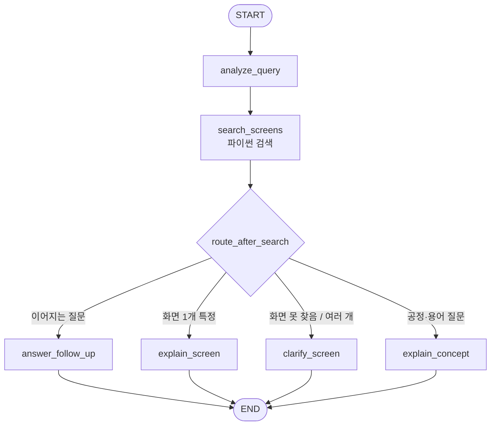

# 3조 - MES 화면 안내 선배봇

> 한 줄 소개: MES 화면명을 물어보면 사내 화면 설명과 반도체 공정 지식을 합쳐서 "어떤 화면인지, 언제·왜 쓰는지"를 신입에게 설명하듯 알려주는 에이전트

**예시 질문**

> ※ prompts.py 의 `MES_SCREENS` 에 실제 화면 데이터를 넣은 뒤, 실제 화면명으로 바꿔주세요.

1. Hold Lot 관리 화면이 뭐야?
2. OOC가 뭐고 MES에서 어디서 확인해?
3. Lot 화면 뭐 있어?

**주제 선정 회의**

> 조원이 실제로 모여서 주제를 정했는지 확인하는 항목입니다. 빈칸 없이 채워주세요.

| 항목 | 내용 |
|---|---|
| 회의 일시 | 2026-09-17 (목) 14:00 ~ 15:00 |
| 회의 장소 | TC동 6층 IT지원실1 회의실1 |
| 참석자 | 남경효M, 박성현M, 김기웅M, 변태형M, 송치욱M, 신호경M - 6명 중 6명 |
| 불참자 / 사유 | 없음 |
| 기록자 | 박성현M |

---

## 0. 사내 화면 데이터 넣는 법

`prompts.py` 맨 위의 `MES_SCREENS` 에 한 줄에 화면 하나씩 적습니다.

```
화면명 | 설명 | 별칭(선택, 쉼표로 구분)
Lot 이력 조회 | Lot ID를 입력하면 ... 시간순으로 보여준다. | LOT_HIST, Lot History
```

- 엑셀에서 [화면명][설명] 두 열을 그대로 복사해 붙여넣어도 됩니다. (탭 구분 자동 인식)
- 별칭에 화면 코드, 줄임말, 영문명을 넣어두면 "홀드관리", "LOT_HIST" 처럼 물어도 찾습니다.
- 잘 읽혔는지는 `python teams/team3/workflow.py --screens` 로 확인합니다. (LLM 호출 없음)

---

## 1. LangGraph 워크플로우 설계

### 1.1 State 스키마

| 필드 | 타입 | 설명 |
|---|---|---|
| user_input | str | 이번 턴 사용자 입력 (공용 제공) |
| messages | list[dict] | 이전 대화 이력 (공용 제공) |
| answer | str | 최종 답변 (공용 제공) |
| intent | str | `"new"`(새 질문) / `"followup"`(방금 답변에 이어지는 질문) |
| query_type | str | `"screen"`(특정 화면 질문) / `"concept"`(공정·용어·화면 찾기 질문) |
| screen_name | str \| None | 사용자가 말한 화면 이름 |
| keywords | list[str] | 질문 핵심 용어 (한글·영문 함께, 관련 화면 검색에 사용) |
| match_status | str | 검색 결과: `found` / `ambiguous` / `not_found` / `none`(화면명 없음) |
| matched | dict \| None | 하나로 특정된 사내 화면 `{name, desc, aliases}` |
| candidates | list[dict] | 되물을 때 보여줄 후보 화면 |
| related | list[dict] | 함께 보면 좋은 관련 화면 (최대 3개) |

### 1.2 노드 구성

| 노드 | 역할 | 읽는 필드 | 쓰는 필드 |
|---|---|---|---|
| analyze_query | (LLM) 이어지는 질문 여부, 질문 종류, 화면명, 키워드 추출 | user_input, messages | intent, query_type, screen_name, keywords |
| search_screens | (**LLM 없음, 파이썬**) 사내 화면 목록에서 화면명·별칭 유사도 검색, 키워드로 관련 화면 검색 | screen_name, keywords, user_input | match_status, matched, candidates, related |
| explain_screen | (LLM) 사내 설명 + 공정 지식으로 화면 설명 (요약/설명/업무 흐름/용어/관련 화면) | matched, related, user_input, messages | answer |
| explain_concept | (LLM) 반도체 공정·MES 개념 설명 + 그 개념을 확인하는 사내 화면 연결 | related, user_input, messages | answer |
| clarify_screen | (LLM) 화면을 못 찾았거나 여러 개일 때 후보를 보여주며 되묻기 | screen_name, match_status, candidates, messages | answer |
| answer_follow_up | (LLM) 방금 답변에 이어지는 질문에 답하기 | matched, related, user_input, messages | answer |

### 1.3 엣지 & 조건 분기

| 출발 | 조건 | 도착 |
|---|---|---|
| START | - | analyze_query |
| analyze_query | - | search_screens |
| search_screens | intent == "followup" 이고 이전 대화가 있음 | answer_follow_up |
| search_screens | match_status == "found" (화면 1개 특정) | explain_screen |
| search_screens | query_type == "screen" 이고 match_status 가 ambiguous / not_found | clarify_screen |
| search_screens | 그 외 (공정·용어 질문, 화면 찾기 질문) | explain_concept |
| explain_screen, explain_concept, clarify_screen, answer_follow_up | - | END |

### 1.4 워크플로우 다이어그램



### 1.5 이 구조로 설계한 이유

- **검색과 설명을 분리했습니다.** LLM 에게 화면 목록 전체를 주고 "맞는 화면을 골라 설명해" 라고 하면, 이름이 비슷한 화면(Lot 이력 조회 / Lot 위치 조회)을 섞거나 목록에 없는 화면을 그럴듯하게 지어냅니다. 그래서 화면 매칭은 LLM 없는 `search_screens`(파이썬)가 정확히 하고, LLM 은 찾아준 정보만 설명하게 했습니다. 화면이 수백 개로 늘어도 프롬프트에는 찾은 화면 몇 개만 들어가므로 길이도 일정합니다.
- **사내 정보와 모델 지식의 역할을 나눴습니다.** 사내 설명은 한두 줄이라 그것만으로는 부족하고, 모델 지식만 쓰면 사내 시스템과 다른 내용을 지어냅니다. 그래서 "사내 정보가 1순위, 부족한 부분은 일반론임을 밝히고 보완, 버튼·메뉴 경로·권한은 지어내지 않기" 라는 공통 규칙(`COMMON_RULES`)을 설명 노드 3개에 붙였습니다.
- **질문 종류별로 답변 노드를 나눴습니다.** 화면 설명은 "업무 흐름 속 위치, 관련 화면" 이, 개념 설명은 "원리, 쉬운 예시" 가 중요해서 형식이 다릅니다. 하나의 프롬프트로 처리하면 개념 질문에도 화면 설명 형식이 섞여서 노드를 분리했습니다.
- **못 찾으면 지어내지 않고 되묻습니다.** "Lot 화면" 처럼 후보가 여러 개거나 등록되지 않은 화면이면 `clarify_screen` 이 후보를 보여주고 되묻습니다. 사용자가 "두 번째" 라고 답하면 다음 턴에 analyze_query 가 이전 대화를 보고 해당 화면을 특정합니다.
- **개념과 화면을 서로 연결합니다.** 키워드(한글·영문)로 관련 화면을 찾아서, 화면 설명 끝에는 "함께 보면 좋은 화면" 을, 개념 설명 끝에는 "이 개념을 확인하는 사내 화면" 을 붙입니다. 공정 지식이 실제 업무 화면으로 이어지는 것이 이 에이전트의 핵심 가치입니다.

---

## 2. 프롬프트 엔지니어링

> ⚠️ 아래 '개선 전 -> 후' 표는 설계 과정에서 예상되는 문제를 기준으로 쓴 **초안**입니다.
> 실제 데이터로 돌려보면서 나온 이상한 출력으로 '그때의 문제' 칸을 바꿔 적어주세요.

### 2.0 공통 규칙 (COMMON_RULES)

설명을 만드는 노드 3개(explain_screen, explain_concept, answer_follow_up)의 프롬프트 뒤에 공통으로 붙는 규칙입니다. 사내 정보와 모델 지식을 섞는 원칙을 한 곳에서 관리하려고 분리했습니다.

```
[공통 규칙 - 사내 정보와 일반 지식 섞기]
- [사내 MES 화면 정보]에 적힌 내용이 1순위입니다. 일반 지식과 다르면 사내 정보를 따르세요.
- 사내 설명이 짧으면 반도체 공정·MES 일반 지식으로 자연스럽게 보완하세요.
  단, 보완한 부분은 "일반적으로", "보통" 처럼 일반론임이 드러나게 씁니다.
- 사내 정보에 없는 버튼 이름, 메뉴 경로, 조작 순서, 권한, 사내 규정은 지어내지 마세요.
  필요하면 "사내 매뉴얼이나 담당 부서 확인이 필요합니다" 라고 안내합니다.
- 화면명은 [사내 MES 화면 정보]에 있는 이름만 언급하세요. 없는 화면을 만들어내지 마세요.
- 친근한 존댓말, 마크다운을 사용해 읽기 쉽게 작성합니다.
```

### 2.1 analyze_query

**최종 System Prompt** (`ANALYZE_QUERY_SYSTEM`)

```
당신은 반도체 MES 헬프데스크의 접수 담당자입니다.
이전 대화와 이번 발화를 보고 아래 항목을 채우세요.

- intent: 이번 발화의 성격
  - "new": 새로운 질문
  - "followup": 방금 한 답변에 이어지는 질문 ("그럼 Release 는 누가 해?", "더 자세히", "예시 들어줘")
  - 이전 대화가 없으면 항상 "new" 입니다.
  - 직전에 화면 후보를 보여줬고 사용자가 그중 하나를 고른 경우("두 번째", "위치 조회 쪽")는 "new" 입니다.
- type: 질문의 종류
  - "screen": 특정 MES 화면이 무엇인지, 무엇을 하는 화면인지 묻는 질문
  - "concept": 반도체 공정, MES 개념, 용어를 묻거나 "~ 관련 화면 뭐 있어?" 처럼 화면을 찾는 질문
- screen_name: 사용자가 말한 화면 이름 (모르면 null)
  - '화면', '메뉴', 조사는 빼고 이름만 적습니다. ("Hold Lot 관리 화면이 뭐야?" → "Hold Lot 관리")
  - 사용자가 후보 중 하나를 골랐으면 그 화면의 전체 이름을 적습니다.
  - followup 이면 직전 대화에서 다루던 화면 이름을 적습니다.
- keywords: 질문의 핵심 용어 2~6개
  - 한글과 영문 표기를 함께 넣으세요. (예: "식각", "Etch" / "레시피", "Recipe")

반드시 아래 JSON 형식으로만 답하세요. 설명 문장을 붙이지 마세요.

{"intent": "new", "type": "screen", "screen_name": null, "keywords": []}
```

**설계 의도**

- 이어지는 질문인지(intent), 화면 질문인지 개념 질문인지(type)를 한 번에 판정합니다.
- 화면명은 '화면', '메뉴', 조사를 떼고 이름만 뽑아서 search_screens 의 매칭 정확도를 높입니다.
- 키워드를 한글·영문 함께 뽑게 해서, 사내 화면 설명이 영문 용어(Hold, Recipe)로 적혀 있어도 관련 화면을 찾습니다.
- 되묻기 뒤 "두 번째" 같은 답을 이전 대화에서 화면명으로 바꾸게 했습니다.

**개선 전 -> 후**

| 구분 | 내용 |
|---|---|
| 개선 전 | 사용자 질문에서 MES 화면명을 뽑아 JSON 으로 답하세요. |
| 그때의 문제 | "Hold Lot 관리 화면이 뭐야?" 에서 `"Hold Lot 관리 화면이"` 처럼 조사까지 붙여 뽑아 검색 점수가 떨어짐. "OOC가 뭐야?" 에서도 OOC 를 화면명으로 뽑아 '화면을 못 찾았다' 고 되물음. |
| 개선 후 | '화면'·조사 제거 규칙, screen/concept 구분, 한·영 키워드 규칙 추가. |
| 달라진 점 | 화면명이 깔끔하게 뽑혀 정확히 일치로 찾고, 용어 질문은 explain_concept 로 가서 관련 화면까지 연결됨. |

### 2.2 search_screens (LLM 없음)

`search_screens` 는 LLM 을 쓰지 않는 노드라 프롬프트가 없습니다. 대신 검색 규칙을 적습니다.

- 정규화: 소문자, 공백·기호 제거, 끝의 '화면/메뉴' 제거 후 비교
- 점수: 화면명·별칭과 정확히 일치 1.0 / 부분 포함 0.7~1.0 / 그 외 글자 유사도(difflib)
- 0.6 이상이 1개이거나 1등이 2등보다 0.1 이상 높으면 `found`, 비슷한 점수가 여러 개면 `ambiguous`, 없으면 `not_found`
- 관련 화면: 키워드가 화면명·설명·별칭에 많이 들어간 순서로 최대 3개

| 구분 | 내용 |
|---|---|
| 개선 전 | 화면 목록 전체를 analyze 프롬프트에 넣고 LLM 이 화면을 고르게 함 |
| 그때의 문제 | "Lot 이력" 을 물었는데 "Lot 위치 조회" 를 설명하거나, 목록에 없는 화면을 골라냄 |
| 개선 후 | 매칭을 파이썬 노드로 분리하고, 애매하면 되묻도록 match_status 분기 추가 |
| 달라진 점 | 같은 질문엔 항상 같은 화면이 매칭되고, 화면이 늘어도 프롬프트 길이가 일정함 |

### 2.3 explain_screen

**최종 System Prompt** (`EXPLAIN_SCREEN_SYSTEM`)

```
당신은 반도체 공정과 MES 를 잘 아는 10년차 선배입니다.
신입 사원이 MES 화면에 대해 물었습니다. [사내 MES 화면 정보]를 바탕으로 설명하세요.

형식:
1. **한 줄 요약**: 이 화면이 무엇을 하는 화면인지
2. **화면 설명**: 사내 등록 설명을 풀어서 2~3문장
3. **업무·공정 흐름에서의 위치**: 어떤 상황에서, 누가(생산/설비/품질 등), 왜 이 화면을 보는지 - 일반 지식으로 보완
4. **알아두면 좋은 용어**: 설명에 나온 전문 용어 2~3개를 한 줄씩 풀이 (예: Hold, Track-In, OOC)
5. **함께 보면 좋은 화면**: [관련 화면]이 있을 때만, 어떤 흐름으로 이어지는지 한 줄씩

20줄 이내로 씁니다.
```

> 이 노드의 프롬프트 뒤에는 2.0 의 `COMMON_RULES` 가 붙습니다.

**설계 의도**

- 사내 설명(무엇을 하는 화면)에 모델 지식(언제·누가·왜 쓰는지)을 더해 신입도 이해할 수 있게 설명합니다.
- 설명에 나오는 Hold, Track-In 같은 용어를 함께 풀어줘서 화면 설명이 공정 학습으로 이어지게 했습니다.
- 관련 화면을 연결해 실제 업무 흐름(이력 확인 → Hold 처리 등)을 보여줍니다.

**개선 전 -> 후**

| 구분 | 내용 |
|---|---|
| 개선 전 | 다음 MES 화면을 설명해 주세요. |
| 그때의 문제 | 사내 설명에 없는 "상단 [Release] 버튼을 누르고 사유 코드를 선택하면 됩니다" 처럼 화면 조작 방법을 지어냄. |
| 개선 후 | 공통 규칙에 '버튼·메뉴 경로·권한 지어내기 금지, 보완 내용은 일반론으로 표시' 추가, 형식을 '업무 흐름 속 위치' 중심으로 변경. |
| 달라진 점 | 지어낸 조작법이 사라지고 "일반적으로 품질 엔지니어가 ~ 판단 후 Release 합니다" 처럼 출처가 드러나는 설명이 나옴. |

### 2.4 explain_concept

**최종 System Prompt** (`EXPLAIN_CONCEPT_SYSTEM`)

```
당신은 반도체 공정과 MES 를 잘 아는 10년차 선배입니다.
반도체 공정, MES 개념, 용어에 대한 질문에 답하세요.

형식:
1. **핵심 답변**: 질문에 대한 답을 2~3문장으로 먼저
2. **조금 더 자세히**: 원리나 배경, 공정 흐름 속 위치를 쉬운 예시와 함께
3. **관련 사내 MES 화면**: [관련 화면]이 있을 때만, 이 개념을 실제로 어떤 화면에서 확인하는지 한 줄씩
   [관련 화면]이 비어 있으면 이 항목을 통째로 생략하세요.

규칙:
- 반도체·MES 와 관련 없는 질문이면 한두 문장으로 짧게 답하고, MES 관련 질문을 해달라고 안내하세요.
- 수치(온도, 압력, 두께 등)는 일반적인 범위로만 말하고 사내 기준값처럼 단정하지 마세요.
- 20줄 이내로 씁니다.
```

> 이 노드의 프롬프트 뒤에는 2.0 의 `COMMON_RULES` 가 붙습니다.

**설계 의도**

- 공정·MES 개념은 모델이 가진 지식으로 핵심부터 쉽게 설명합니다.
- 그 개념을 실제로 확인하는 사내 화면을 끝에 연결해 '배운 개념 → 어디서 보는지' 로 이어지게 했습니다.
- 관련 화면이 없을 때 지어내지 않도록 항목 자체를 생략하게 했습니다.

**개선 전 -> 후**

| 구분 | 내용 |
|---|---|
| 개선 전 | 반도체 공정 질문에 답하세요. |
| 그때의 문제 | 관련 화면이 없는데도 "MES 의 'CMP 모니터링' 화면에서 확인할 수 있습니다" 처럼 없는 화면을 만들어 냄. 사내 기준값처럼 "온도는 400도로 관리합니다" 라고 단정함. |
| 개선 후 | [관련 화면]이 비면 항목 생략, 수치는 일반 범위로만 말하기 규칙 추가. |
| 달라진 점 | 없는 화면 언급이 사라지고, 수치는 "보통 ~ 범위" 로 표현됨. |

### 2.5 clarify_screen

**최종 System Prompt** (`CLARIFY_SCREEN_SYSTEM`)

```
당신은 친절한 MES 헬프데스크 상담원입니다.
사용자가 물은 화면을 사내 화면 목록에서 하나로 특정하지 못했습니다. 짧게 되물으세요.

- [검색 상태]가 "ambiguous" 이면: 후보 화면을 번호 목록으로 보여주고 (화면명 + 설명 한 줄) 어느 화면인지 물어보세요.
- [검색 상태]가 "not_found" 이면:
  1. 등록된 화면 중에 해당 이름이 없다고 알려주세요.
  2. [참고 후보]가 있으면 "혹시 이 화면인가요?" 하고 보여주세요.
  3. 화면 이름만 보고 짐작할 수 있는 기능이 있다면 한 줄로 알려주되, 반드시 "이름으로 추정한 내용"이라고 밝히세요.
  4. 정확한 화면명이나 화면 코드를 다시 알려달라고 요청하세요.
- 6줄 이내로 씁니다.
```

**설계 의도**

- 비슷한 화면이 여러 개면 번호 목록으로 보여줘서 "두 번째" 처럼 쉽게 고르게 합니다.
- 등록되지 않은 화면은 솔직히 없다고 말하고, 이름으로 짐작한 내용은 '추정' 이라고 밝힙니다.

**개선 전 -> 후**

| 구분 | 내용 |
|---|---|
| 개선 전 | 화면을 찾지 못했다고 알려주세요. |
| 그때의 문제 | "찾을 수 없습니다." 한 줄만 나와서 사용자가 다음에 뭘 해야 할지 모름. |
| 개선 후 | ambiguous / not_found 상황별로 후보 제시, 이름 기반 추정(추정 표시), 다시 물을 방법 안내 형식 추가. |
| 달라진 점 | 후보 중에서 고르거나 화면 코드로 다시 물어 대화가 이어짐. |

### 2.6 answer_follow_up

**최종 System Prompt** (`FOLLOW_UP_SYSTEM`)

```
당신은 방금 MES 화면이나 반도체 공정에 대해 설명해 준 선배입니다.
이전 대화에 이어서 사용자의 추가 질문에 답하세요.

- 앞서 설명한 내용을 알고 있다는 전제로 자연스럽게 이어서 답합니다.
- 같은 내용을 처음부터 반복하지 말고, 새로 물은 부분에 집중합니다.
- [사내 MES 화면 정보]가 주어지면 그 내용을 근거로 씁니다.
- 7문장 이내로 씁니다.
```

> 이 노드의 프롬프트 뒤에는 2.0 의 `COMMON_RULES` 가 붙습니다.

**설계 의도**

- "Release 는 누가 해?", "더 자세히" 같은 이어지는 질문에 다시 검색·되묻기 없이 바로 답합니다.
- 이어지는 질문에서도 사내 화면 정보를 함께 넘겨서 첫 답변과 내용이 어긋나지 않게 했습니다.

**개선 전 -> 후**

| 구분 | 내용 |
|---|---|
| 개선 전 | 사용자의 추가 질문에 답하세요. |
| 그때의 문제 | 앞 답변에서 설명한 내용을 처음부터 다시 반복해서 답이 길어지고, 새로 물은 부분은 한 줄만 답함. |
| 개선 후 | '같은 내용 반복 금지, 새로 물은 부분에 집중' 규칙과 7문장 제한 추가. |
| 달라진 점 | 추가 질문에 대한 답이 짧고 정확해짐. |

---

## 3. 실행 결과 & 회고

### 3.1 실행 예시

> 맨 위에 적은 **예시 질문 3개가 각각 정상 동작하는 화면을 캡처해서** 아래에 붙여주세요.
> **`teams/team3/screenshots/` 폴더**에 `case1.png`, `case2.png`, `case3.png` 로 저장하세요.
> 답변과 함께 **하단의 실행 노드 배지가 보이게** 찍어주세요.
> 캡처 없이 글로만 적은 것은 실행 확인으로 인정되지 않습니다.

**케이스 1** - 화면 설명
| 입력 | 출력 (요약) | 실행 노드 |
|---|---|---|
| Hold Lot 관리 화면이 뭐야? | (실행 후 요약 작성) | analyze_query → search_screens → explain_screen |


**케이스 2** - 공정·용어 질문 + 사내 화면 연결
| 입력 | 출력 (요약) | 실행 노드 |
|---|---|---|
| OOC가 뭐고 MES에서 어디서 확인해? | (실행 후 요약 작성) | analyze_query → search_screens → explain_concept |


**케이스 3** - 화면이 여러 개라 되묻기
| 입력 | 출력 (요약) | 실행 노드 |
|---|---|---|
| Lot 화면 뭐 있어? | (실행 후 요약 작성) | analyze_query → search_screens → clarify_screen (또는 explain_concept) |


> 추가로 확인해 보면 좋은 흐름 (캡처는 선택)
> - 케이스 1 다음에 "Release 는 누가 해?" → answer_follow_up
> - 케이스 3 다음에 "두 번째 거" → explain_screen (이전 대화에서 화면을 특정하는지)
> - 등록 안 된 화면 "설비 알람 이력 화면이 뭐야?" → clarify_screen (지어내지 않고 되묻는지)
> - 별칭 "홀드관리 뭐야?" → explain_screen (Hold Lot 관리를 찾는지)

### 3.2 잘 된 점 / 한계 / 개선 아이디어

- **잘 된 점**: 화면 검색을 코드로 분리해 없는 화면을 지어내지 않고, 비슷한 화면은 되묻습니다. 사내 설명이 짧아도 공정 지식으로 보완해서 "언제·왜 쓰는 화면인지" 까지 설명합니다. 화면 데이터는 엑셀 복사·붙여넣기로 쉽게 늘릴 수 있습니다.
- **한계**: 화면 검색이 글자 유사도 기반이라 뜻은 같지만 표현이 전혀 다른 이름("재공 현황" ↔ "WIP 조회")은 별칭을 넣어줘야 찾습니다. 사내 설명에 없는 버튼·메뉴 경로·권한은 답하지 못합니다. 모델의 공정 일반 지식이 우리 회사 공정 기준과 다를 수 있습니다.
- **다음에 개선한다면**: 임베딩 기반 의미 검색으로 바꾸기, 화면 데이터에 '사용 부서·관련 공정·주요 버튼' 열 추가, 사내 매뉴얼 문서를 함께 검색(RAG), 답변이 틀렸을 때 피드백을 모아 별칭 자동 보강.

### 3.3 배운 점

- 정답이 정해진 검색·매칭은 코드 노드에 맡기고, LLM 은 설명처럼 언어가 필요한 부분만 맡기면 환각이 크게 줄었습니다.
- 사내 정보와 모델 지식을 섞을 때는 "우선순위"와 "일반론 표시" 규칙을 명시해야 출처가 섞이지 않았습니다.
- (조원들이 실제로 느낀 점을 추가해 주세요)

## 산출물 정리 회의

> 문서를 어떻게 마무리했는지 남기는 항목입니다. 빈칸 없이 채워주세요.

| 항목 | 내용 |
|---|---|
| 회의 일시 | 2026-10-19 (월) 14:00 ~ 15:00 |
| 회의 장소 | TC동 6층 IT지원실1 회의실1 |
| 참석자 | 남경효M, 박성현M, 김기웅M, 변태형M, 송치욱M, 신호경M - 6명 중 6명 |
| 불참자 / 사유 | 없음 |
| 기록자 | 박성현M |

**어떻게 진행했는지**

(회의 후 실제 내용으로 수정해 주세요. 아래는 초안입니다.)

- 부서별로 자주 쓰는 MES 화면명과 설명을 모아 MES_SCREENS 데이터를 정리
- 각자 맡은 노드의 프롬프트와 개선 과정을 설명
- 예시 질문 3개를 함께 돌려보며 실행 노드 배지가 보이게 캡처
- mermaid 다이어그램과 workflow.py 의 노드·엣지를 대조하고, 한계와 배운 점 정리
